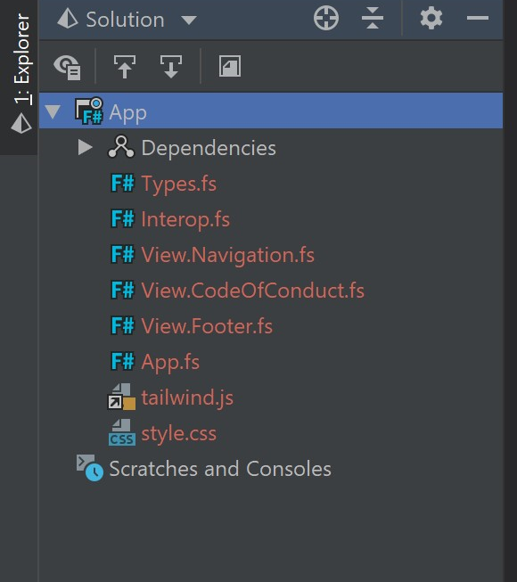

# Virtual Domain-Driven Design

An online Domain-Driven Design meetup and conference for the community by the community. Help us develop this world wide community further!
We are continuously updating the website and functionality, if you have any ideas or bugs you want to share please feel free to add a ticket!

## Add a new DDD community

We have build in the functionality to add a Domain-Driven Design community. All you need to do is add it to the `src/data/Queries.Communities.fs` yourself and send a PR an we will make sure it will get online! The format of the community is as followed:

```
  {
    name = "The name of your community"
    country = "The country"
    city = "If your community is bound to a city, it is an optional field"
    url: "Url to the website of your community"
    img: "A image you want to show"
  }
```

## To help develop Virtual Domain-Driven Design

```
# Using Yarn
yarn
```

After that, start up Webpack Development Server:

```
yarn watch
```

Webpack Development Server will watch the F# sources as well as `/src/style.css` and `/tailwind.js` and rebuild your stylesheet on every change. You'll have a hot reloading website under 'localhost:8080'

All you need to develop is the F# Project in the src folder. All other files are maybe interesting to understand the dev-backend, but not necessary to develop and build.



## Build and deploy

```
yarn build
```

After building, upload the content of the folder '/public' to the webserver.